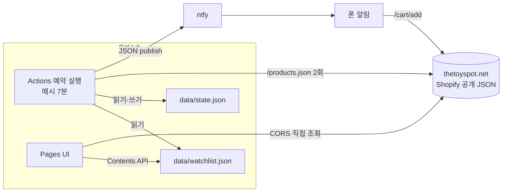

# restock-notifier — 개인용 재입고 알림 시스템

관심 있는 쇼핑몰 상품이 다시 입고되면 폰으로 알려 주고, 탭 한 번으로 장바구니까지 담아 주는 도구입니다.
서버 없이 GitHub Actions 예약 실행과 GitHub Pages만으로 동작하며, 운영 비용은 0원입니다.

| | |
|---|---|
| 형태 | 개인 프로젝트 (1인 개발·운영) |
| 스택 | Node.js (의존성 0), GitHub Actions, GitHub Pages, ntfy, 바닐라 JS |
| 저장소 | https://github.com/PJunHyk/restock-notifier |
| 관리 UI | https://pjunhyk.github.io/restock-notifier/ |

## 1. 문제

해외 피규어·커스텀 파츠 쇼핑몰(Shopify 기반)은 인기 옵션이 자주 품절되고, 재입고는 예고 없이 짧게 열렸다 닫힙니다.
직접 새로고침하며 확인하는 방식은 비효율적이고, 놓치기 쉽습니다. 다음 조건으로 도구를 만들었습니다.

- 관심 상품의 **옵션(variant) 단위** 재입고만 감지할 것
- 알림을 받은 즉시 **장바구니에 담을 수 있을 것** (결제는 직접)
- **서버·유료 서비스 없이** 운영할 것
- 쇼핑몰에 부담을 주지 않고, 공개된 데이터만 쓸 것

## 2. 구조



- **수집**: 전체 카탈로그(`/products.json`)를 실행당 2요청으로 가져옵니다. 로그인이나 HTML 크롤링은 하지 않습니다.
- **판정**: 이전 상태(`state.json`)와 현재 재고를 비교하는 순수 함수입니다.
- **알림**: 상품명, 재입고 옵션, 가격, 상품 링크, "장바구니 담기" 버튼을 담아 ntfy로 보냅니다.
- **관리 UI**: 정적 페이지 하나로, 상품 검색·옵션 선택·저장을 처리합니다. 저장은 GitHub Contents API로 관심 목록 파일에 바로 커밋합니다.

## 3. 핵심 설계 결정

### 3.1 재입고의 정의를 명확히 했습니다
정확한 재고 수량은 공개되지 않으므로 재고 있음/없음만 다룹니다. 규칙은 다음과 같습니다.

- 이전 **품절 → 현재 재고 있음**으로 바뀔 때만 알림
- **첫 실행은 기준 상태만 저장**하고 알림을 보내지 않음 (기존 재고 상품 폭탄 알림 방지)
- "모든 옵션"으로 등록한 상품은 **나중에 추가된 새 옵션**이 재고 있음으로 올라와도 알림
- 특정 옵션만 등록한 상품에서, 등록 이후 처음 보는 옵션은 기준만 저장
- 옵션 목록은 하드코딩하지 않고 매번 새로 읽음

이 규칙을 `detect()` 순수 함수로 분리해 네트워크 없이 단위 테스트했습니다(테스트 11개).

### 3.2 자동 결제는 하지 않았습니다
기술적으로 가능하더라도 만들지 않았습니다. 봇 탐지·캡차, 결제 정보 보관 위험, 약관 위반 가능성, 중복 주문 위험 때문입니다.
알림 버튼은 장바구니에 1개를 담고 **장바구니 페이지에서 멈추며**, 결제는 사용자가 직접 진행합니다.

### 3.3 서버 없이 운영
GitHub Actions의 `schedule`로 폴링하고, 상태는 저장소의 JSON 파일로 관리합니다. 상태가 바뀔 때만 커밋하므로 이력이 지저분해지지 않습니다.

- 스케줄은 워싱턴 D.C.(미국 동부 시간) 기준입니다. 02·04·06시는 2시간 간격, 그 외는 1시간 간격으로 하루 22회 실행합니다. 정각 혼잡을 피해 매시 7분에 실행합니다.
- GitHub cron은 UTC만 쓰므로, 매시 실행하되 첫 단계에서 `America/New_York` 시각을 계산해 03·05시를 건너뜁니다. 서머타임이 자동으로 반영됩니다.
- **꺼짐 방지**: 공개 저장소는 60일간 활동이 없으면 예약 실행이 중단됩니다. 마지막 커밋이 30일이 넘으면 빈 커밋을 남기도록 했습니다.
- 동시 실행이 상태 파일을 덮어쓰지 않도록 `concurrency` 그룹을 지정했습니다.

### 3.4 실패에 안전하게
- 카탈로그 조회는 어느 페이지든 실패하면 **부분 결과를 쓰지 않고** 상태 변경 없이 종료합니다. 조회 실패를 "전부 품절"로 오판하는 사고를 막기 위해서입니다.
- 알림 전송이 실패하면 **그 상품의 상태를 갱신하지 않아** 다음 실행에서 다시 시도합니다. 알림이 조용히 유실되지 않습니다.
- 카탈로그에서 사라진 상품은 경고만 남기고 이전 상태를 유지합니다.

## 4. 만들면서 확인하고 고친 것

구현 전에 실제 쇼핑몰 응답으로 가정을 검증했고, 그 과정에서 설계를 바꾼 지점이 있습니다.

| 발견 | 조치 |
|---|---|
| Shopify 표준 링크 `/cart/{id}:1`이 **장바구니가 아닌 Shop Pay 체크아웃으로 리다이렉트**됨 | `/cart/add?id=…&quantity=1&return_to=/cart`로 교체. 결제 직전이 아니라 장바구니에서 멈춤을 응답으로 확인하고, 단위 테스트로 고정 |
| 가격 통화가 요청마다 달라짐 (같은 상품이 `22.99`와 `32000`으로 응답) | 통화 기호를 붙이지 않고 "참고용"으로 표기 |
| `/products/{handle}.js`와 `/products.json`의 재고 값이 같은지 불확실 | 상품 40개를 대조해 불일치 0건 확인 후, 정기 감시는 카탈로그 2요청으로 단순화 |
| 브라우저에서 쇼핑몰 JSON을 직접 읽을 수 있을지 불확실 | CORS 헤더를 확인하고 UI가 서버 없이 직접 조회하도록 구성 |
| ntfy는 HTTP 헤더로 제목을 보내면 한글이 깨질 수 있음 | 헤더 대신 **JSON publish API**(본문)로 전송 |

## 5. 보안과 공개 범위

저장소를 Public으로 둔 것(Pages 무료 사용)을 전제로 무엇을 숨길지 정했습니다.

- **비공개**: ntfy 토픽(알림 채널)은 Actions Secret에만 둡니다. 추측 불가능한 랜덤 값이며 코드·로그에 남기지 않습니다.
- **토큰 최소 권한**: 관리 UI용 GitHub 토큰은 이 저장소 하나, Contents 읽기/쓰기만, 만료일을 설정합니다. 브라우저 localStorage에만 저장되고 사이트·저장소에는 없습니다.
- **개인정보**: 커밋 작성자 이메일은 noreply 주소로 설정해 공개 이력에 실제 이메일이 남지 않게 했습니다.
- **공개되는 것**: 코드, 공개 상품 정보, 관심 목록, 실행 로그. 관심 목록은 민감하지 않다고 판단해 공개했습니다.
- **UI 접근**: 페이지는 누구나 열 수 있지만, 저장은 토큰이 있어야만 가능합니다. 상품 제목 등 외부 데이터는 `textContent`로 렌더링해 XSS를 막았습니다.
- 알려진 한계: `github.io` 도메인의 localStorage는 같은 계정의 다른 Pages 사이트와 공유되므로, 토큰의 권한 범위를 좁게 두는 것으로 피해를 제한했습니다.

## 6. 검증

- 판정 로직 단위 테스트 11개: 첫 실행, 품절→재고, 유지, 미지정 옵션, 새 옵션(재고 있음/품절), 사라진 상품, 워치리스트 검증, 장바구니 링크 형식
- 실제 카탈로그(382개 상품, 옵션 493개)로 종단 테스트
- 상태를 임시로 "품절"로 바꿔 **재입고를 강제로 발생**시키고, 실제 폰 알림 수신과 장바구니 담기까지 확인
- 테스트 후 상태가 정상으로 복구되어 같은 알림이 반복되지 않음을 확인

## 7. 한계와 다음 단계

- 정확한 재고 수량은 알 수 없고 재고 있음/없음만 알 수 있습니다.
- 스케줄은 GitHub 사정으로 10~20분 이상 지연될 수 있어, 짧은 재입고는 놓칠 수 있습니다.
- 통화가 요청 지역에 따라 달라져 가격 표기는 참고용입니다.
- 확장 후보: 신상품 알림, 재입고 이력과 가격 추이 대시보드.

## 8. 저장소 구조

```
src/
  shopify.mjs   카탈로그 수집, 링크 생성
  detect.mjs    재입고 판정 (순수 함수)
  notify.mjs    알림 메시지 구성, ntfy 전송
  check.mjs     실행 진입점
test/           판정·메시지 단위 테스트
docs/index.html 관리 UI (GitHub Pages)
data/           관심 목록, 상태
.github/workflows/check.yml  예약 실행, 상태 커밋, 꺼짐 방지
```
